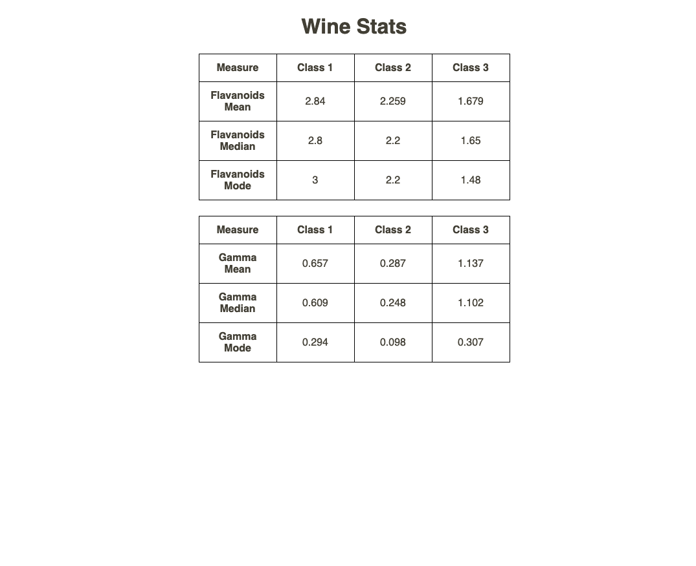

# Live Link

[Deployed to Netlfy](https://wine-stats.netlify.app/)



# React CRA Boilerplate with Prettier, ESLint, Husky, and TypeScript

This is a boilerplate project for creating React applications with the following features:

- [Prettier](https://prettier.io/): Code formatter for consistent code style.
- [ESLint](https://eslint.org/): JavaScript and TypeScript linter for maintaining code quality.
- [Husky](https://typicode.github.io/husky): Git hooks for automated linting and formatting.
- [TypeScript](https://www.typescriptlang.org/): Typed superset of JavaScript for enhanced development.

## Getting Started

1. Clone this repository:

```bash
git clone https://github.com/shubhlpu16/wine-dataset.git
cd wine-dataset
```

2. Install dependencies:

```bash
npm install
```

3. Start the development server:

```bash
npm start
```

4. Use absolute import in `src/`

```bash
import [anything] from '@/[path]'
```

## Available Scripts

- `npm start`: Starts the development server.
- `npm run build`: Builds the app for production.
- `npm run format`: Formats the code using Prettier.
- `npm run lint`: Lints the code using ESLint.
- `npm run lint:fix`: Lints and fixes the code using ESLint.

## Project Structure

- `src/`: Contains the source code of the application.
  - `routes/`: React Routes Container.
  - `App.tsx`: Main application component.
- `public/`: Static assets and `index.html`.
- `styles/`: Global Styles
- `components/`: Reusuable components
- `package.json`: Project configuration and dependencies.
- `tsconfig.json`: TypeScript configuration.
- `.prettierrc`: Prettier configuration.
- `.eslintrc.js`: ESLint configuration.
- `.husky/`: Husky Git hooks configuration.

## Contributing

Feel free to contribute to this project. Create a pull request or open an issue for any suggestions or improvements.

## License

This project is licensed under the [MIT License](LICENSE).

```

Please make sure to replace `yourusername` and `your-repo` with your actual GitHub username and repository name. This `README.md` provides detailed information about the project, including installation instructions, available scripts, project structure, and contribution guidelines.
```
